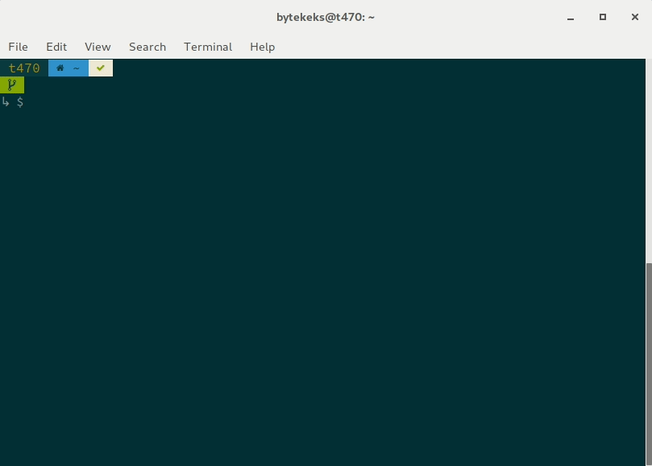

# Tradfri cli

This is a small cli for controlling my IKEA tradfri lights.

It's using [https://github.com/CliffS/ikea-tradfri](https://github.com/CliffS/ikea-tradfri).



## Get started

* `securityCode` from the back of your tradfri Gateway
* `tradfriGatewayUrl` Url or IP address of your tradfri Gateway (local network of course)

```js
{
  "securityCode": "",
  "tradfriGatewayUrl": ""
}
```

* Run `npm run init`
* your credentials will be printed in the console
* credentials.json will be created (wip)

* Run 'npm start` to test your stuff with nodemon running